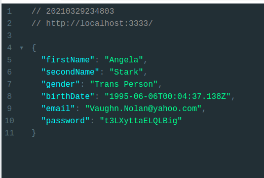

# Random User - api

A ideia foi construir uma api utilizando o express, de modo que seja possível obter um usuário aleatório muito semelhante a api do [randomuser](https://randomuser.me/)

## Como executar o programa?

- Execute o comando `npm install` na raiz do projeto
- após instalar as depêndencias vc pode "ligar o servidor" com o comando `npm run dev`

## Demonstração da api

